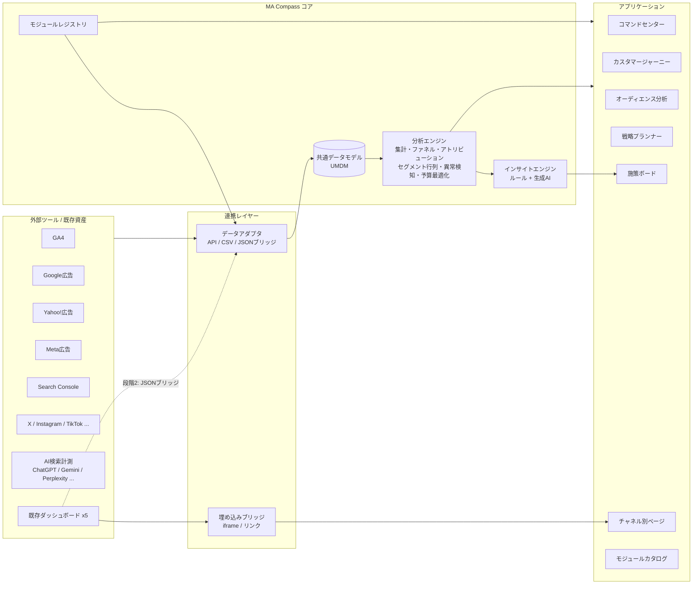
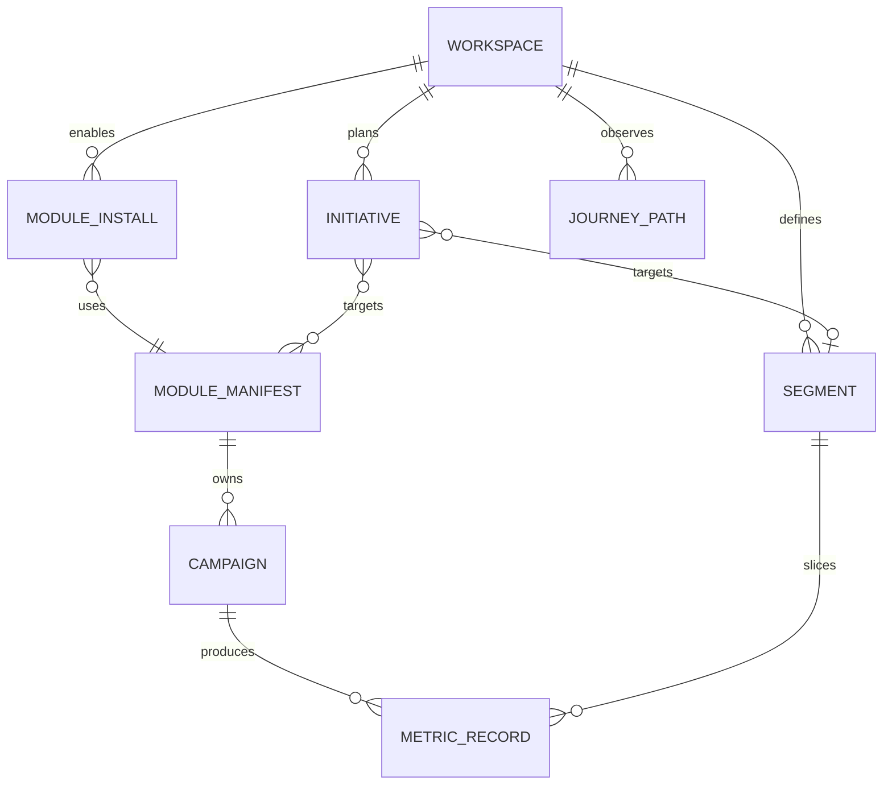
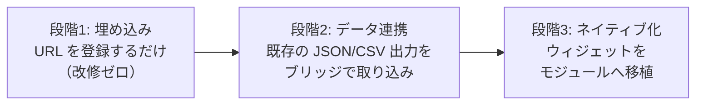
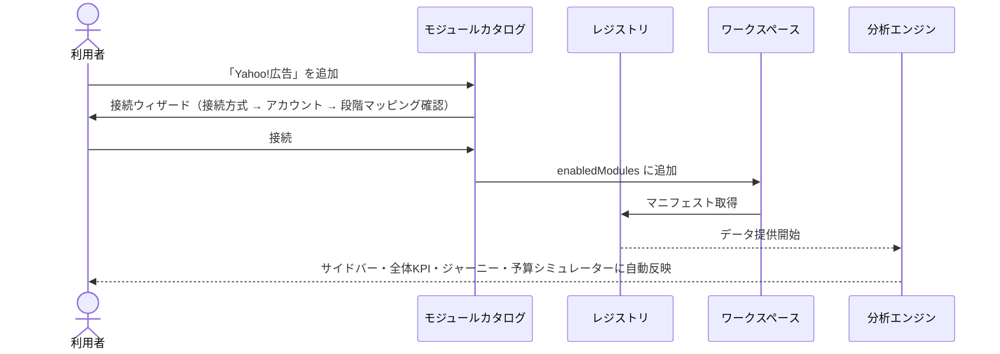

# MA Compass 全体設計書

| 項目 | 内容 |
|---|---|
| 文書バージョン | v0.1（初版） |
| 作成日 | 2026-09-26 |
| 対象 | MA Compass（統合マーケティングオートメーション基盤） |
| 関連文書 | [要件定義書](./02-requirements.md) / [機能仕様書](./03-functional-spec.md) / [モジュール追加ガイド](./04-module-guide.md) |

---

## 1. コンセプト

> **「ツールごとにログインして数字を眺める」状態から、「顧客の行動から逆算して、誰に・何を・どこで届けるかを決めて実行する」状態へ。**

多くの企業では Google広告、Yahoo!広告、Meta広告、Search Console、GA4、X、Instagram などを個別の管理画面で見ています。MA Compass はそれらを **1つの共通データモデル** に集約し、次の 4 つを一気通貫で行う基盤です。

| # | 役割 | 画面 |
|---|---|---|
| 1 | **可視化**：全チャネルの成果を同じ物差しで見る | コマンドセンター / 各チャネル |
| 2 | **理解**：カスタマージャーニー上で、どの接点が成果につながっているかを見る | カスタマージャーニー / オーディエンス分析 |
| 3 | **立案**：KGI/KPI と予算配分を決める | 戦略プランナー |
| 4 | **実行・検証**：施策を起票し、成果を追う | 施策ボード / AIインサイト |

### 1.1 設計原則

1. **既存資産を捨てない** — 既存の 5 ダッシュボード（GA / Google広告 / SEO / SEO・GEO・AIO・LLMO / SNS）は、改修なしで「埋め込み」から取り込み、段階的にデータ連携・ネイティブ化する（§4）。
2. **モジュール（プラグイン）で拡張する** — Yahoo!広告や Meta広告などは「モジュール定義（マニフェスト）＋データアダプタ」を 1 つ追加するだけで、ナビゲーション・全体KPI・ジャーニー・予算シミュレーターに自動で反映される。
3. **企業ごとに構成が違う前提** — ワークスペース（企業）単位で、有効なモジュール・セグメント・KGI・予算を持つ。
4. **ジャーニーが共通言語** — すべてのモジュールは「どのジャーニー段階の接点か」を宣言する。これにより、異なるツールのデータを同じ地図の上に並べられる。
5. **インサイトは施策に直結させる** — 分析結果は「施策化」ボタンで施策ボードに起票でき、効果検証まで追える。

---

## 2. システム全体像



### 2.1 レイヤー構成

| レイヤー | 責務 | MVP（本リポジトリ） | 本番（Phase 2 以降） |
|---|---|---|---|
| プレゼンテーション | 画面・操作・アニメーション | React SPA（実装済み） | 同左 |
| モジュールレイヤー | モジュール定義・ナビ生成・画面構成 | `src/modules/*`（実装済み） | 同左＋外部パッケージ化 |
| データアクセス | `DataProvider` インターフェース | `MockProvider`（シード付き合成データ） | `ApiProvider`（BFF 経由） |
| 分析エンジン | 集計・ジャーニー・アトリビューション・最適化 | `src/core/analytics/*`（純粋関数・テスト済み） | BFF/バッチへ移設可能（DOM 非依存で実装） |
| 連携（BFF） | OAuth トークン保管、API 取得、スケジュール同期 | なし（設計のみ） | Node.js BFF + ジョブキュー |
| データ基盤 | 正規化データの保管 | ブラウザメモリ＋localStorage | PostgreSQL / BigQuery |

分析エンジンは **DOM に依存しない純粋な TypeScript** で書いているため、将来 BFF やバッチジョブにそのまま移せます。

---

## 3. 共通データモデル（UMDM: Unified Marketing Data Model）

異なるツールのデータを「同じ物差し」で扱うための中核です。



### 3.1 主要エンティティ

| エンティティ | 概要 | 主な属性 |
|---|---|---|
| Workspace | 企業（テナント） | 業種、事業モデル（BtoB/BtoC）、KGI、月予算、有効モジュール |
| ModuleManifest | モジュール定義 | id、カテゴリ、接続方式、担当ジャーニー段階、提供指標、ウィジェット、既存ダッシュボードURL |
| Segment | 顧客セグメント（ペルソナ） | 名称、説明、構成比、基準CVR、客単価 |
| Campaign | 各モジュール内の施策単位 | キャンペーン / キーワード群 / 投稿カテゴリ など |
| MetricRecord | 日次の正規化データ | 日付 × モジュール × キャンペーン × セグメント × 訴求軸 の指標値 |
| JourneyPath | 顧客の接点経路 | 接点の並び、到達人数、CV数、平均日数 |
| Initiative | 施策 | ステータス、対象モジュール・セグメント・段階、KPI、期待効果、起票元インサイト |

### 3.2 共通指標（Metric）

すべてのモジュールは、次の共通指標のうち提供できるものを埋めます。モジュール固有の指標は `extra` に入れます。

| キー | 名称 | 例 |
|---|---|---|
| `impressions` | 表示回数 / リーチ | 広告表示、検索表示、SNSリーチ |
| `clicks` | クリック | 広告クリック、検索クリック、リンククリック |
| `cost` | 費用（円） | 広告費。オーガニックは 0 |
| `sessions` | セッション | GA4 セッション |
| `engagements` | エンゲージメント | いいね・保存・シェア・コメント |
| `conversions` | コンバージョン | 問い合わせ、購入、資料請求 |
| `revenue` | 売上（円） | 購入金額 / 見込み売上 |

派生指標（CTR・CPC・CVR・CPA・ROAS など）はエンジン側で計算し、各モジュールが独自に計算しない（計算式の一元化）。

### 3.3 カスタマージャーニー段階

| 段階ID | 名称 | 典型的な接点 |
|---|---|---|
| `awareness` | 認知 | SNS、ディスプレイ広告、PR |
| `interest` | 興味・関心 | SNS、SEO（情報収集KW）、AI検索 |
| `consideration` | 比較・検討 | 検索広告、SEO（比較KW）、AI検索、事例ページ |
| `conversion` | 購入・CV | 指名検索広告、リターゲティング、LP |
| `loyalty` | 継続・推奨 | メール、LINE、SNS |

モジュールはマニフェストで `stages` を宣言します。ジャーニー画面・アトリビューション・ファネルはこの宣言を使って自動的に構成されます。

---

## 4. 既存ダッシュボードの取り込み戦略（3 段階）

既存の 5 ダッシュボードは「作り直さない」ことを前提に、段階的に統合します。



| 段階 | やること | 既存側の改修 | 得られること |
|---|---|---|---|
| 1. 埋め込み | モジュールの「既存ダッシュボード」タブに URL を登録 | なし | 1 画面・1 ナビゲーションから全ダッシュボードへ到達 |
| 2. データ連携 | 既存ダッシュボードが持つデータを `bridge` 形式（§4.1）の JSON/CSV で出力、または既存の出力をアダプタで変換 | 出力処理の追加のみ | 全体KPI・ジャーニー・予算最適化に数値が反映 |
| 3. ネイティブ化 | 既存のチャートやロジックを `widgets` として移植 | 移植 | 共通 UI・ダークモード・権限管理に統合 |

既存ダッシュボードとモジュールの対応：

| 既存ダッシュボード | 対応モジュール | 担当段階 |
|---|---|---|
| Googleアナリティクスダッシュボード | `ga4` | 全段階（サイト内行動） |
| Google広告ダッシュボード | `google-ads` | 比較・検討 / 購入・CV |
| SEOダッシュボード | `seo` | 興味・関心 / 比較・検討 |
| SEO/GEO/AIO/LLMO | `ai-search` | 興味・関心 / 比較・検討 |
| SNSダッシュボード | `sns` | 認知 / 興味・関心 / 継続・推奨 |

### 4.1 ブリッジ形式（段階2）

既存ダッシュボードから次の形の JSON（または同じ列名の CSV）を出せば取り込めます。

```json
{
  "module": "google-ads",
  "records": [
    {
      "date": "2026-09-01",
      "campaign": "指名キーワード",
      "segment": "decision-maker",
      "metrics": { "impressions": 1200, "clicks": 180, "cost": 36000, "conversions": 9, "revenue": 900000 }
    }
  ]
}
```

- `segment` は任意（未指定は「全体」として按分）。
- 取り込み時にスキーマ検証を行い、不正な行は理由付きでスキップします（`src/core/data/bridge.ts`）。

---

## 5. モジュール（プラグイン）アーキテクチャ

### 5.1 モジュールマニフェスト

```ts
interface ModuleManifest {
  id: string;                    // 'yahoo-ads'
  name: string;                  // 'Yahoo!広告'
  category: 'analytics' | 'ads' | 'search' | 'social' | 'crm' | 'local' | 'custom';
  origin: 'existing' | 'builtin' | 'custom'; // 既存資産 / 標準 / 利用者作成
  connection: ConnectionType[];  // 'oauth' | 'apiKey' | 'bridge' | 'embed' | 'sample'
  stages: StageId[];             // 担当するジャーニー段階
  paid: boolean;                 // 予算シミュレーター対象か
  kpis: MetricKey[];             // モジュールページの KPI タイル
  widgets: WidgetSpec[];         // モジュールページの構成
  sample?: SampleProfile;        // サンプルデータ生成パラメータ
  legacyDashboardUrl?: string;   // 既存ダッシュボード（段階1）
}
```

### 5.2 モジュール追加の流れ



- **標準モジュール**：コードで定義（`src/modules/`）。開発者が 1 ファイル追加 → `index.ts` に登録。
- **カスタムモジュール**：画面から作成（名称・カテゴリ・担当段階・埋め込みURL・ブリッジデータ）。コード不要。

---

## 6. 分析エンジン

| 機能 | 手法 | 実装 |
|---|---|---|
| 全体KPI | 期間集計・前期間比較 | `analytics/aggregate.ts` |
| ファネル | 段階別の到達数・遷移率 | `analytics/journey.ts`（`stageDropoff`） |
| カスタマージャーニー | 接点経路の集計、段階間フロー（サンキー） | `analytics/journey.ts` |
| アトリビューション | ラストクリック / ファーストクリック / 線形 / 減衰 / 接点ベース(40-20-40) | `analytics/attribution.ts` |
| セグメント×アプローチ | セグメント × チャネル（または訴求軸）の CVR 指数 | `analytics/matrix.ts` |
| 異常検知 | 直近 7 日 vs 過去 28 日の z スコア | `analytics/anomaly.ts` |
| 予算最適化 | 収穫逓減の応答曲線 `CV = Cmax(1 − e^(−s/k))` と限界CV最大化の貪欲法 | `analytics/simulator.ts` |
| インサイト | ルールベース（MVP）→ 生成AIで文章化・戦略提案（Phase 2） | `analytics/insights.ts` |

---

## 7. 技術スタック

| 領域 | 採用 | 理由 |
|---|---|---|
| フロントエンド | React 19 + TypeScript + Vite | 既存ダッシュボード（Claude Code 製）との親和性、高速ビルド |
| 状態管理 | Zustand（永続化付き） | 軽量。ワークスペース構成をブラウザに保存 |
| スタイル | Tailwind CSS v4 + CSS 変数トークン | ライト/ダーク両対応をトークンで一元管理 |
| チャート | Recharts + 独自 SVG | 標準チャートは Recharts、ジャーニーのフロー図は独自 SVG（離脱・粒子アニメーション付き） |
| アニメーション | Motion | 画面遷移・数値カウントアップ・カード移動 |
| テスト | Vitest | 分析エンジンの単体テスト |
| 本番 BFF（Phase 2） | Node.js（Hono など）+ PostgreSQL/BigQuery + ジョブキュー | OAuth トークンをサーバー側でのみ保持 |

---

## 8. セキュリティ設計（要点）

| 観点 | 方針 |
|---|---|
| 認証情報 | OAuth トークン・API キーは **BFF のみ** で保持し、KMS 等で暗号化保存。フロントエンドには渡さない。MVP では認証情報を一切扱わない |
| 権限 | 取得は読み取り専用スコープを基本とする（広告の入稿・変更は Phase 3 で別途承認フロー付きで検討） |
| テナント分離 | すべてのデータに `workspaceId` を付与し、BFF で行レベル制御 |
| ロール | Owner / Admin / Editor / Viewer |
| 埋め込み | https の URL のみ登録可。iframe は `sandbox` 属性付き。本番では CSP `frame-src` を許可リスト管理 |
| 監査 | モジュール追加・接続・削除、施策の状態変更を監査ログに記録（Phase 2） |
| 取り込みデータ | ブリッジ取り込み時にスキーマ検証。数値以外・負値・日付不正は拒否 |

---

## 9. ロードマップ

| フェーズ | 期間目安 | 内容 |
|---|---|---|
| **Phase 1: MVP（本リポジトリ）** | 完了 | 画面一式、モジュール基盤、カタログ・カスタムモジュール、埋め込み、JSON/CSV ブリッジ、分析エンジン、サンプルデータ、デモ公開 |
| Phase 2: 実データ接続 | 4〜6 週 | BFF、OAuth（Google / Yahoo! / Meta）、既存ダッシュボードのブリッジ出力追加、DB、ロール・監査ログ、生成AIインサイト |
| Phase 3: 実行の自動化 | 6〜8 週 | 施策から広告・配信ツールへの反映（承認フロー付き）、レポート自動配信、アラート通知（Slack / メール） |
| Phase 4: 高度化 | 継続 | データドリブンアトリビューション、MMM、予測、CRM 連携による LTV 最適化 |
