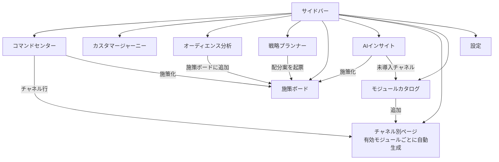

# MA Compass 機能仕様書

| 項目 | 内容 |
|---|---|
| 文書バージョン | v0.1（初版） |
| 作成日 | 2026-09-26 |
| 関連文書 | [全体設計書](./01-architecture.md) / [要件定義書](./02-requirements.md) / [モジュール追加ガイド](./04-module-guide.md) |

要件 ID（`FR-xx-nn`）は[要件定義書](./02-requirements.md)に対応します。

---

## 1. 画面一覧と遷移



| 画面 | パス | 要件 |
|---|---|---|
| コマンドセンター | `/` | FR-CC-01〜07 |
| カスタマージャーニー | `/journey` | FR-JR-01〜06 |
| オーディエンス分析 | `/audience` | FR-AU-01〜05 |
| 戦略プランナー | `/strategy` | FR-ST-01〜05 |
| 施策ボード | `/execution` | FR-EX-01〜05 |
| AIインサイト | `/insights` | FR-IN-01〜03 |
| チャネル別ページ | `/m/:moduleId` | FR-CH-01〜04 |
| モジュールカタログ | `/catalog` | FR-MD-01〜08 |
| 設定 | `/settings` | FR-WS-01〜05 |

---

## 2. 共通レイアウト

### 2.1 サイドバー

| 区画 | 内容 |
|---|---|
| ロゴ | MA Compass |
| 戦略 | コマンドセンター / カスタマージャーニー / オーディエンス分析 / 戦略プランナー |
| 実行 | 施策ボード（未完了件数バッジ）/ AIインサイト（高優先度件数バッジ） |
| チャネル | **有効モジュールから自動生成**。モジュールの色ドット・名称・既存資産バッジ。追加時はアニメーションで挿入 |
| 管理 | モジュールカタログ / 設定 |

画面幅 1024px 未満ではドロワー表示（ハンバーガーで開閉）。

### 2.2 トップバー

| 要素 | 仕様 |
|---|---|
| ワークスペース切替 | 企業名 + 業種。選択で全画面のデータが切り替わる（FR-WS-01） |
| 期間 | 直近 7日 / 28日 / 90日。比較対象は直前の同日数（FR-CC-03） |
| テーマ | ライト / ダーク / システム |
| データ状態 | 「サンプルデータ」表示（MVP） |

### 2.3 共通の数値表記

| 指標 | 表記 | 計算式 |
|---|---|---|
| 金額 | `¥1,234,567`、大きな値は `¥1.2億` / `¥345万` | — |
| 件数 | `12,345`、大きな値は `1.2万` | — |
| CTR | `3.21%` | clicks ÷ impressions |
| CPC | `¥123` | cost ÷ clicks |
| CVR | `2.45%` | conversions ÷ sessions（sessions が 0 のモジュールは clicks） |
| CPA | `¥12,345` | cost ÷ conversions（費用 0 は「—」） |
| ROAS | `456%` | revenue ÷ cost |
| 前期比 | `+12.3%` / `−4.5%` | (当期 − 前期) ÷ 前期。「良い方向」は指標ごとに定義（CPA は減少が良い） |

---

## 3. コマンドセンター（`/`）

### 3.1 構成

```
┌ KGI カード（大きな数値・目標・達成率メーター・前期比） ┬ 指標タイル×4（スパークライン付き） ┐
├ 日別推移（チャネル別折れ線、指標切替：CV / 費用 / セッション）              ┬ アラート       ┤
├ チャネル別成果表                                                            ├ 注目インサイト ┤
└ ジャーニー段階ファネル                                                      ┴──────────────┘
```

### 3.2 仕様

| 要素 | 仕様 |
|---|---|
| KGI カード | KGI が `revenue` なら売上、`conversions` なら CV 数。目標は「月間目標 × 期間日数 ÷ 30」で按分。達成率 = 実績 ÷ 按分目標。100% 以上「達成ペース」、80〜100%「注意」、80% 未満「未達ペース」 |
| 指標タイル | 広告費・CV・CPA・ROAS（BtoB は「見込み売上」）・セッション。前期比と 12 点スパークライン |
| 日別推移 | 有効モジュールごとの折れ線（色はモジュール固定色）。ホバーで全チャネルの値をツールチップ表示 |
| チャネル別成果表 | 列：チャネル / 費用 / CV / CPA / ROAS / 前期比（CV）/ 推移。行クリックでチャネル別ページへ |
| ファネル | カスタマージャーニーのシミュレーション結果（§4.3）から段階別の到達人数と遷移率を表示 |
| アラート | 異常検知（§9.2）の結果。重大度アイコン + ラベル + 内容 |
| 注目インサイト | 優先度「高」上位 3 件。「施策化」で施策ボードへ起票 |

---

## 4. カスタマージャーニー（`/journey`）

### 4.1 構成

| 要素 | 仕様 |
|---|---|
| セグメント選択 | 「全体」+ ワークスペースのセグメント（チップ） |
| フロー図 | 列 = 認知 / 興味・関心 / 比較・検討 / 購入・CV接点 / 結果（CV・離脱）。ノード = その段階で接触したチャネル。リンク幅 = 人数。リンク上を粒子が流れるアニメーション（`prefers-reduced-motion` 時は停止） |
| ノード操作 | ホバーで流入・流出人数、クリックでそのチャネルを含む経路をハイライト |
| 段階別離脱 | 各段階の到達人数・次段階への遷移率・離脱率。最大離脱段階に「最大の離脱」ラベル |
| CV 経路上位 | 経路（チャネルの並び）/ 到達人数 / CV / CVR / 平均所要日数。上位 8 件 |
| アトリビューション | モデル選択（ラストクリック / ファーストクリック / 線形 / 減衰 / 接点ベース）。チャネル別の貢献 CV を、選択モデルとラストクリックの横並びで比較 |

### 4.2 段階とモジュールの対応

各モジュールのキャンペーンは 1 つの段階を持ちます（例：Google広告「指名検索」= 購入・CV、「一般検索」= 比較・検討）。モジュールの担当段階はキャンペーン段階の和集合です。

### 4.3 ジャーニー・シミュレーション（`analytics/journey.ts`）

MVP では個人単位のログを持たないため、集計データのパラメータから顧客経路を合成します（Phase 2 で GA4 の BigQuery エクスポート等の実経路に置き換え）。

1. 利用者を 8,000 人生成し、セグメント構成比でセグメントを割り当てる。
2. 段階 `awareness → interest → consideration → conversion` を順に進む。各段階で:
   - 接触確率 `p_touch(stage)` で接触が発生。接触チャネルは、その段階にキャンペーンを持つ有効モジュールから、`段階ボリューム × セグメント親和度` の重みで抽選。
   - 接触後、継続確率 `p_continue(stage)` を下回れば「離脱」で終了。
3. `conversion` 段階の接触後、`基準CVR(セグメント) × 経路上の親和度平均 × 接点数ボーナス` の確率で CV。
4. 各接触に経過日数（ワークスペースの検討期間に応じた乱数）を付与。
5. シミュレーション上の CV 数を、期間の実 CV 数（MetricRecord 合計）に合わせて拡大縮小し、表示人数とする。

乱数はワークスペース ID をシードとした決定的乱数で、同じ条件なら同じ結果になります。

### 4.4 アトリビューション（`analytics/attribution.ts`）

CV した経路の各接点に貢献度を配分します（合計 = 1）。

| モデル | 配分 |
|---|---|
| ラストクリック | 最後の接点に 100% |
| ファーストクリック | 最初の接点に 100% |
| 線形 | 全接点に均等 |
| 減衰 | CV までの日数 d に対し重み `2^(−d/7)`（半減期 7 日）を正規化 |
| 接点ベース | 最初 40%・最後 40%・中間で 20% を均等。接点 1 つなら 100%、2 つなら 50/50 |

---

## 5. オーディエンス分析（`/audience`）

| 要素 | 仕様 |
|---|---|
| 列の切替 | チャネル（有効モジュール）/ 訴求軸（価格・事例/実績・機能/品質・限定/緊急・共感/ストーリー） |
| 基準の切替 | 全体平均（全体 CVR = 100）/ セグメント内（各セグメントの平均 CVR = 100。どのアプローチが相対的に効くかを見る） |
| ヒートマップ | 行 = セグメント、列 = チャネル or 訴求軸。セル値 = **CVR 指数**（セルの CVR ÷ 全体 CVR × 100）。色は発散配色（100 = 灰、高い = 青、低い = 赤）。セル内に数値を表示 |
| セル選択 | 右パネルに詳細：CV / CVR / CPA / 指数 / 母数、推奨アクション文、「施策ボードに追加」 |
| 勝ちパターン | セグメントごとに「最適チャネル × 最適訴求」と CVR 指数（常にセグメント内基準）、推奨メッセージ |
| 母数不足 | セッション（または clicks）が 30 未満のセルは斜線表示・「母数不足」 |

推奨アクション文の生成ルール：

| 指数 | 文言パターン |
|---|---|
| 140 以上 | 「{セグメント}には{チャネル}が特に有効。配分・露出を増やす」 |
| 110〜139 | 「有効。訴求を{最適訴求}に寄せてさらに改善」 |
| 90〜109 | 「平均的。テストで差別化」 |
| 60〜89 | 「弱い。ターゲティング・訴求の見直し」 |
| 60 未満 | 「非効率。除外・入札引き下げを検討」 |

---

## 6. 戦略プランナー（`/strategy`）

### 6.1 KPI ツリー

KGI から必要値を逆算します。「必要値」= 他の要素が現状のままで KGI 目標を達成するのに必要な値。

| KGI | ツリー |
|---|---|
| 売上（BtoC） | 売上 = CV × 客単価 / CV = セッション × CVR / セッション = 有料 + 自然検索 + SNS + AI検索 + その他 |
| CV（BtoB・地域） | CV = セッション × CVR / セッション = 有料 + 自然検索 + SNS + AI検索 + その他 / 見込み売上 = CV × 単価（参考） |

各ノード：実績 / 必要値 / 達成率 / 状態ピル（達成・注意・未達）。流入内訳は構成比バー付き。

### 6.2 予算シミュレーター（`analytics/simulator.ts`）

| 項目 | 仕様 |
|---|---|
| 対象 | 有効な有料モジュール（`paid: true`） |
| 現状 | 直近 28 日の費用・CV を 30 日換算 |
| 応答曲線 | `CV(s) = Cmax × (1 − e^(−s/k))`。現状点 (s0, c0) とモジュールの飽和度 x0 から `k = s0 / x0`、`Cmax = c0 / (1 − e^(−x0))` |
| スライダー | 各チャネル 0 〜 現状の 2.5 倍（データ外の外挿を避ける上限） |
| 総予算 | ワークスペースの月間予算（画面で変更可） |
| 最適配分 | 総予算を 200 分割し、限界 CV `Cmax/k × e^(−s/k)` が最大のチャネルへ順に割り当てる貪欲法（上限を超えない） |
| 表示 | 予測 CV・CPA・売上・ROAS を現状比で表示（数値はアニメーションで遷移）。応答曲線に現状点と配分案の点 |
| 起票 | 「配分案を施策として起票」で、増減額付きの施策を作成 |

---

## 7. 施策ボード（`/execution`）

| 項目 | 仕様 |
|---|---|
| 列 | 企画中 / 準備中 / 実行中 / 効果検証 / 完了 |
| カード | タイトル、対象チャネル（色ドット）、セグメント、段階、KPI、期待効果、期限、担当、起票元バッジ（インサイト / オーディエンス / 予算 / 手動） |
| 移動 | ドラッグ＆ドロップ。キーボード利用時はカードの編集画面でステータスを変更 |
| 作成・編集 | モーダル。必須：タイトル。任意：説明・チャネル（複数）・セグメント・段階・KPI・期待効果・担当・期限 |
| 削除 | 編集モーダル内で「削除」→ 確認ボタン |
| 保存 | ワークスペースごとにブラウザへ保存（Phase 2 は DB） |

---

## 8. チャネル別ページ（`/m/:moduleId`）

### 8.1 タブ構成

| タブ | 内容 |
|---|---|
| 概要 | KPI タイル（マニフェスト `kpis`）、日別推移、キャンペーン別内訳表、モジュール固有ウィジェット |
| 既存ダッシュボード | 登録 URL の埋め込み（iframe, sandbox 付き）と「別タブで開く」。URL 未登録なら登録フォーム。https 以外は登録不可 |
| データ連携 | 接続方式・状態、ブリッジ取り込み（ファイル選択 / 貼り付け）、取り込み結果（件数・スキップ理由）、「サンプルデータに戻す」、段階マッピング表 |

### 8.2 モジュール固有ウィジェット

| ウィジェット | モジュール | 内容 |
|---|---|---|
| `ga4-channels` | GA4 | チャネルグループ別セッション・CV・CVR（全モジュールの流入を集計） |
| `seo-keywords` | SEO | 順位分布（1-3 / 4-10 / 11-20 / 21+）、キーワード表（順位・前回比・表示・クリック・CTR）、4〜10 位に「上位化候補」 |
| `ai-citations` | AI検索 | エンジン別（ChatGPT / Gemini / Perplexity / AI Overviews / Copilot / Claude）の引用率・言及数、トピック別の引用状況 |
| `sns-platforms` | SNS | プラットフォーム別リーチ・エンゲージメント率・フォロワー増減・流入 |

### 8.3 ブリッジ取り込み（`core/data/bridge.ts`）

| 項目 | 仕様 |
|---|---|
| 形式 | JSON（[全体設計書 §4.1](./01-architecture.md#41-ブリッジ形式段階2)）または CSV（列：`date,campaign,segment,impressions,clicks,cost,sessions,engagements,conversions,revenue`） |
| 検証 | `date` は `YYYY-MM-DD`、指標は 0 以上の数値、`campaign` は必須。違反行は行番号と理由を返してスキップ |
| 上限 | 1 モジュールあたり 5,000 行（ブラウザ保存容量のため） |
| 反映 | 取り込んだモジュールはサンプルデータの代わりに取り込みデータを使う。未知のキャンペーンは担当段階の先頭に割り当て |

---

## 9. 分析ロジック

### 9.1 集計（`analytics/aggregate.ts`）

- `summarize(records)`：共通指標の合計と派生指標。
- `byModule / byDate / byCampaign / bySegment`：グルーピング集計。
- 期間：当期 = 直近 N 日（今日を含まない）、前期 = その直前 N 日。

### 9.2 異常検知（`analytics/anomaly.ts`）

モジュール × 指標（CV・CPA・クリック）ごとに、直近 7 日の日平均と、その前 28 日の日平均・標準偏差から z スコアを算出。

| 条件 | 重大度 |
|---|---|
| \|z\| ≥ 3 | 重大（critical） |
| 2 ≤ \|z\| < 3 | 警告（warning） |

悪化方向（CV 減、CPA 増、クリック減）のみアラート。改善方向は「好調」として別表示。

### 9.3 インサイト（`analytics/insights.ts`）

| 種類 | 発火条件 | 優先度 |
|---|---|---|
| 予算再配分 | 同じ総予算の最適配分で予測 CV が 3% 以上増 | 高 |
| 異常 | 異常検知で重大 / 警告 | 高 / 中 |
| 勝ちセグメント | CVR 指数 140 以上の有料チャネル × セグメント | 中 |
| 非効率 | CVR 指数 60 未満かつ費用が当該チャネルの 15% 以上 | 中 |
| SEO 上位化 | 4〜10 位で表示回数上位のキーワード | 中 |
| AI検索引用 | 引用率 20% 未満のエンジン | 中 |
| 評価の偏り | 線形 ÷ ラストクリック ≥ 1.5 のチャネル | 低 |
| ジャーニー離脱 | 最大離脱段階 | 中 |
| 未導入チャネル | 推奨条件に合う未導入モジュール（例：40 代以上のセグメントが 30% 以上 → Yahoo!広告） | 低 |

各インサイトは「タイトル / 根拠数値 / 期待効果 / 推奨アクション（施策テンプレート）」を持ちます。

---

## 10. モジュールカタログ（`/catalog`）

| 要素 | 仕様 |
|---|---|
| 一覧 | カテゴリ（計測 / 広告 / 検索 / SNS / 地域 / CRM・メール / カスタム）別のカード。バッジ：既存資産・標準・カスタム・近日対応・追加済み |
| 追加 | 接続ウィザード：①接続方式（OAuth / APIキー / ブリッジ / 埋め込み / サンプルデータ）②アカウント選択（MVP は模擬）③段階マッピング確認 → 完了。完了でサイドバーに挿入アニメーション |
| 停止 | 「このワークスペースから外す」→ 確認。施策・取り込みデータは保持 |
| カスタム作成 | 名称・説明・カテゴリ・担当段階（複数）・有料か・既存ダッシュボード URL。作成後は「データ連携」タブでブリッジ取り込み可能。データ未取り込みの間はカテゴリ標準のサンプルを表示 |

## 11. 設定（`/settings`）

| 要素 | 仕様 |
|---|---|
| 企業情報 | 企業名、業種、事業モデル、KGI 種別、KGI 月間目標、月間広告予算、検討期間（日） |
| セグメント | 名称・説明・構成比（%）の編集、追加・削除。構成比の合計が 100% でない場合は警告 |
| 企業の追加 | テンプレート（BtoB / EC / 地域ビジネス）と企業名から作成 |
| 企業の削除 | 確認付き。最後の 1 社は削除不可 |
| 初期化 | サンプル状態に戻す（確認付き） |

---

## 12. データ永続化（MVP）

| キー | 内容 |
|---|---|
| `ma-compass:v1` | ワークスペース構成、カスタムモジュール、既存ダッシュボード URL、施策、取り込みデータ、表示設定 |

localStorage が使えない環境（プライベートブラウズ等）でも、保存なしで動作を継続する。
