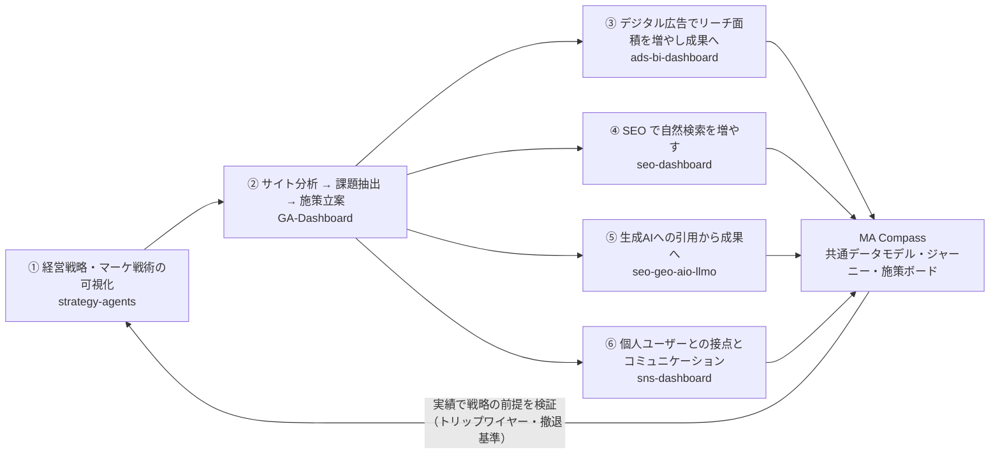
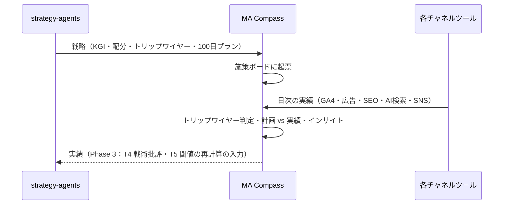

# 統合設計書：6 ツールを 1 つの MA 基盤へ

| 項目 | 内容 |
|---|---|
| 文書バージョン | v0.2 |
| 作成日 | 2026-09-30 |
| 対象リポジトリ | strategy-agents / GA-Dashboard / ads-bi-dashboard / seo-dashboard / seo-geo-aio-llmo / sns-dashboard |
| 関連文書 | [全体設計書](./01-architecture.md) / [要件定義書](./02-requirements.md) / [機能仕様書](./03-functional-spec.md) / [モジュール追加ガイド](./04-module-guide.md) |

---

## 1. 構想の整理

個別に設計してきた 6 つの仕組みは、1 本の流れとして並べると「戦略 → 分析 → 実行 → 学習」のループになります。

MA Compass の役割は、6 ツールを置き換えることではありません。次の 3 つを担う「共通の土台」です。

1. **共通の物差し**：6 ツールの数値を同じ指標・同じ期間・同じジャーニー段階で並べる
2. **戦略と実績の接続**：strategy-agents が決めた KGI・前提・撤退基準を、各チャネルの実績で常時チェックする
3. **実行の一元管理**：各ツールの提案と戦略の行動計画を、1 つの施策ボードで回す

---

## 2. 6 リポジトリの調査結果

| # | リポジトリ | 形態 | データ取得 | 出力（取り込める形） | AI | 統合上の注意 |
|---|---|---|---|---|---|---|
| ① | strategy-agents | Claude Code のエージェント定義（Markdown）＋静的 HTML レポート | WebSearch（エージェント実行時） | `dashboard.html` 内の `REPORT_DATA`、`tactics-data.js` の `TACTICS_DATA`、CSV | Claude Code（opus） | 呼び出す API がない。出力は JS オブジェクトと Markdown |
| ② | GA-Dashboard | Express＋素の JS（ローカル） | GA4 Data API（サービスアカウント） | `data/cache/<property>/*.json`、`/api/*` | Anthropic SDK | 日付が `YYYYMMDD`。全チャネルを含む（二重計上に注意） |
| ③ | ads-bi-dashboard | React＋Express（ローカル） | Google Ads API、GA4、Search Console | `/api/summary` ほか | Anthropic SDK | **Yahoo!・Meta は未実装**。認証情報がないとモックを返す（`isMock`）。売上（conversions_value）未取得 |
| ④ | seo-dashboard | Express＋素の JS（ローカル） | Search Console、GA4、DataForSEO | `/api/gsc/metrics`、`/api/rankings/matrix` | Anthropic SDK | **認証が仮実装、API キーを SQLite に平文保存**。GSC のクエリ別データは期間集計のみ |
| ⑤ | seo-geo-aio-llmo | Claude Code の診断ワークスペース（アプリではない） | Search Console（スクリプト）、LLM は手動クエリ | `deliverables/<client>/<日付>/data.json` | Claude Code | 言及率は探索的な推定値。トピック×エンジンの行列データはない。レポートは埋め込み禁止の設計 |
| ⑥ | sns-dashboard | React＋Express＋SQLite（ローカル） | Meta Graph API・Threads（X・YouTube は未実装） | `/api/metrics/clients/:id/*`、CSV 出力 | Anthropic SDK | DM・コメント本文は保存しない。投稿の承認フローは本ツールに残すべき |

**共通点**：すべてローカル実行で、ホスティングされていません。そのため「埋め込み（iframe）」は実運用に向かず、**データ連携を主軸**にします。

---

## 3. 統合方針

### 3.1 何をどこに残すか

| 機能 | 置き場所 | 理由 |
|---|---|---|
| 戦略の生成（リサーチ・仮説・批評・最終提案） | strategy-agents | 長時間・人の承認ゲート付きの対話型プロセス。SPA では持てない |
| 各チャネルの深掘り分析・運用（入札・投稿承認・記事生成・診断） | 各ツール | 各ツールの強み。作り直さない |
| 横断の数値・ジャーニー・セグメント分析・予算配分 | **MA Compass** | 1 ツールでは見えない |
| 戦略と実績の突き合わせ・施策管理 | **MA Compass** | 戦略とチャネル実績の両方を持つのは MA Compass だけ |

### 3.2 連携の 3 段階（v0.1 の方針を実態に合わせて更新）

| 段階 | 内容 | 状態 |
|---|---|---|
| **A. ネイティブ取り込み** | 各ツールが**すでに出している JSON** をそのまま MA Compass に取り込む。ツール側の改修ゼロ | **本リリースで実装** |
| B. ブリッジ API | 各ツールに `GET /api/bridge` を 1 本追加し、日次×キャンペーン粒度で出力 | Phase 2（§5 に仕様） |
| C. 自動同期 | 中継サーバー（BFF）がブリッジ API を定期取得。strategy-agents は Agent SDK でジョブ化 | Phase 3 |

---

## 4. 本リリースで実装した連携（段階 A）

画面：**連携ハブ**（`/connect`）。ファイルを選ぶか貼り付けると形式を自動判別します（`src/core/connectors/index.ts`）。

| ツール | 取り込むもの | 変換先 | 変換のポイント |
|---|---|---|---|
| strategy-agents | `node scripts/export-strategy.mjs <projects/id>` の出力 | 経営戦略画面 | `REPORT_DATA` / `TACTICS_DATA` を隔離した実行環境で抽出。戦術のみ（パッケージ C）のプロジェクトにも対応 |
| GA-Dashboard | `daily-channels.json` | GA4 モジュール | Direct / Referral のみ取り込み、他チャネルは除外（二重計上の防止）。日付を ISO に変換 |
| ads-bi-dashboard | `/api/summary` のレスポンス | Google広告モジュール | 費用・CV を日次で取り込み。モックデータの場合は警告 |
| seo-dashboard | `/api/gsc/metrics`、`/api/rankings/matrix` | SEO モジュール、キーワード順位表 | 最新順位を採用。CV は GA4 側で計測 |
| seo-geo-aio-llmo | `data.json` | AI検索モジュールの TVS・8 軸・エンジン別言及率・AI 経由流入・改善ロードマップ | `"12%"` などの文字列を数値化。推定値は「診断値・探索的」と明示 |
| sns-dashboard | `/daily?metric=impressions` のレスポンス | SNS モジュール | プラットフォーム＝キャンペーン、段階はプラットフォームごとに割当 |

実データでの検証：strategy-agents の 2 プロジェクト（戦略＋戦術 / 戦術のみ）と seo-geo-aio-llmo の診断 data.json で、変換と画面表示を確認済み。

### 4.1 新設した「経営戦略」画面（`/plan`）

strategy-agents の成果物を、実行と接続する形で表示します。

| 要素 | 内容 | 実績との接続 |
|---|---|---|
| 戦略カーネル | 診断 → 基本方針 → 行動、今日決めること | — |
| KGI・シナリオ | シナリオ別の値と重み、達成確率の幅、KPI、撤退・転換基準 | — |
| **トリップワイヤー** | 戦略で定義した警戒ライン | **指標・対象チャネル・閾値を設定すると、直近 28 日の実績で自動判定。発火すると AIインサイトに優先度「高」で表示** |
| **チャネル配分：計画 vs 実績** | 戦術の投資配分 | **チャネル名からモジュールを自動判定し、実際の費用・CV の構成比と並べる。未導入のチャネルはカタログへ誘導** |
| ペルソナ | 課題・目標・接点 | オーディエンス分析のセグメントとして反映できる |
| 100 日プラン | 週単位のガント | 施策ボードへ一括起票（起票元「経営戦略」） |

---

## 5. Phase 2：各ツールへのブリッジ API 追加（仕様）

段階 A はツールの既存出力を使うため、粒度が粗い箇所があります（例：広告はアカウント合計）。各ツールに次の 1 本を追加すると、キャンペーン単位の日次データで連携できます。形式は [全体設計書 §4.1](./01-architecture.md#41-ブリッジ形式段階2) のブリッジ形式です。

| ツール | 追加するエンドポイント | 実装の要点 |
|---|---|---|
| GA-Dashboard（**実装済み**） | `GET /api/bridge?propertyId&startDate&endDate` | `ga4-fetcher.js` に `['date','sessionCampaignName','sessionDefaultChannelGroup']` × `['sessions','engagedSessions','conversions','purchaseRevenue']` の定義を追加 |
| ads-bi-dashboard（**実装済み**） | `GET /api/bridge/:clientId?preset` | GAQL に `segments.date, campaign.name, campaign.advertising_channel_type, metrics.conversions_value` を追加。`cost_micros / 1e6`。`isMock` を必ず返す |
| seo-dashboard（**実装済み**） | `GET /api/bridge?domain_id&from&to` | 取得済みの `gsc_metrics_daily` を日次で返す（第 1 段階）。キーワードのカテゴリ別集計（GSC を `['date','query']` で取得）は次段階 |
| seo-geo-aio-llmo | （data.json のスキーマ拡張） | `llmCitationAnalysis.queryMatrix[{keyword, llm, cited, form, withLink}]` を追加し、トピック×エンジン行列を実測に置き換える |
| sns-dashboard | `GET /api/bridge/:clientId?days` | `metrics_account_daily` と `metrics_post` を日×プラットフォームで集計（engagements＝いいね＋コメント＋シェア＋保存、clicks＝website_clicks） |
| strategy-agents | 最終ステップで `strategy.json` を出力 | `05_final` / `T5` 完了時に `scripts/export-strategy.mjs` 相当を自動実行。トリップワイヤーに `metric / op / value` を持たせると手動設定が不要になる |

---

### 5.1 実装状況（v0.3）

| ツール | 状態 | 追加したもの |
|---|---|---|
| ads-bi-dashboard | 実装済み（ブランチ `claude/clever-turing-ah636y`） | `/api/bridge/:clientId`（キャンペーン×日次、売上＝conversions_value、推定時は `revenueSource` で明示、モック時は `isMock`）、`?client=&section=` のディープリンク |
| GA-Dashboard | 実装済み（同上） | 取得定義 `daily-campaign-channels`、`/api/bridge`（CORS 許可リスト・任意の Bearer トークン・登録済みプロパティのみ）、`?propertyId=&tab=` のディープリンク、テスト |
| seo-dashboard | 実装済み（同上） | `/api/bridge`（Search Console 日次、CORS 許可リスト・任意の Bearer トークン）、認証情報の暗号化保存（`SECRETS_KEY`、既存の平文は起動時に移行）、環境変数での受け渡し、`AUTH_MODE=access`（Cloudflare Access の JWT 検証）、待ち受けを `127.0.0.1` に限定、テスト |
| MA Compass | 実装済み | 連携ハブの「API から取得」、支援先ごとの接続先設定、チャネル画面から各ツールへの詳細リンク、支援先一覧 |

## 6. 戦略 ↔ 実行ループの設計

Phase 3 では、MA Compass の実績を strategy-agents の T4（戦術批評）と T5（運用閾値）に渡し、「確度 C（仮定）」の数値を実測に置き換えます。

---

## 7. ロードマップ

| フェーズ | 内容 | 各リポジトリの作業 |
|---|---|---|
| **v0.2（本リリース）** | 連携ハブ（ネイティブ取り込み）、経営戦略画面、トリップワイヤー監視、AI検索診断の表示 | なし（改修不要） |
| Phase 2（4〜6 週） | ブリッジ API（§5）、中継サーバー（BFF）、認証・権限 | 各ツールに API 1 本ずつ。seo-dashboard のキーを環境変数へ移す |
| Phase 3（6〜8 週） | 自動同期、strategy-agents のジョブ化（Agent SDK・人の承認ゲートを状態として管理）、実績の戦略へのフィードバック | strategy-agents に `strategy.json` 出力とトリップワイヤーの数値化 |
| Phase 4 | Yahoo!・Meta 広告アダプタ、SNS の X・YouTube、生成 AI による横断インサイト | ads-bi-dashboard / sns-dashboard の未実装 API |

---

## 8. 調査で見つかったリスク（対応を推奨）

| 重要度 | リポジトリ | 内容 | 推奨対応 |
|---|---|---|---|
| 高→対応済み | seo-dashboard | Claude API キー・DataForSEO 認証情報・Google トークンを SQLite に平文保存、認証が仮実装 | 対応済み（§5.1）。運用時に `SECRETS_KEY` を設定すること |
| 中→対応済み | ads-bi-dashboard | 認証情報がないと自動でモックを返す。CORS が全開放 | 対応済み：ブリッジ出力に `isMock`、CORS 許可リスト（`CORS_ALLOWED_ORIGINS`）、`BRIDGE_TOKEN` |
| 中 | seo-geo-aio-llmo | 報告書バージョン間でフィールド名が揺れる（例：`projectedTvs` / `tvsForecast`） | スキーマのバージョンを固定（取り込み側は主要項目のみ使用） |
| 低 | sns-dashboard | ドキュメント間でポート番号が不一致（3001 / 3002） | 表記統一 |
| 低 | strategy-agents | 出力が文章中心で数値が文字列（「¥800万」「20%」） | トリップワイヤーと KPI に数値フィールドを追加 |

---

## 9. 決めていただきたいこと

1. **Phase 2 の着手順**：効果が大きいのは ads-bi-dashboard（キャンペーン×日次＋売上）と GA-Dashboard（キャンペーン×チャネル）のブリッジ API です。この 2 本から始めてよいか。
2. **ホスティング**：6 ツールはすべてローカル実行です。MA Compass と中継サーバーをどこに置くか（例：strategy-agents・seo-geo-aio-llmo と同じ Cloudflare）。
3. **Yahoo!・Meta 広告**：ads-bi-dashboard を拡張するか、MA Compass 側にアダプタを持つか。
