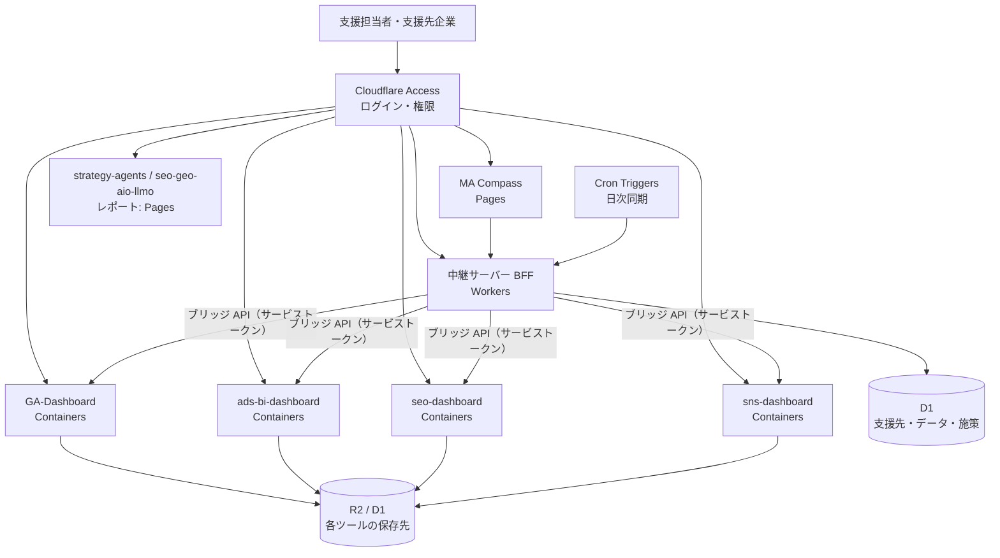

# 公開設計書：Cloudflare でのホスティングと認証

| 項目 | 内容 |
|---|---|
| 文書バージョン | v0.1 |
| 作成日 | 2026-09-30 |
| 前提 | MA Compass と既存 6 ツールを、ログイン認証つきで公開する。複数の支援先企業で使う |
| 関連文書 | [統合設計書](./05-integration-design.md) |

---

## 1. 結論

**Cloudflare で公開できます。** ただし、既存ツールのうち 2 つの制約（下表の ❌）があるため、構成を「そのまま動かすもの」と「Cloudflare 向けに置き換えるもの」に分けます。

| 要件 | Cloudflare の対応 | 判定 |
|---|---|---|
| MA Compass（静的 SPA）の公開 | Pages | ✅ そのまま |
| ログイン認証（全ツール共通） | Zero Trust Access（Google アカウント・メールのワンタイムコード等） | ✅ コード変更なし |
| 中継サーバー（BFF）・定期同期 | Workers ＋ Cron Triggers ＋ D1 / KV | ✅ 新規実装 |
| API キー・トークンの保管 | Workers Secrets（暗号化） | ✅ |
| Express 製の既存ツールをそのまま動かす | Containers | ✅ ただしディスクは揮発性（下記） |
| SQLite（better-sqlite3）での永続化 | ❌ Containers のディスクはスリープ後に消える | → D1 または R2 へ移行 |
| Google 公式クライアント（Google Ads / GA4 の gRPC ライブラリ）を Workers で実行 | ❌ Workers は外向きの gRPC 非対応 | → Containers で動かす、または REST API に置き換え |
| strategy-agents（Claude Code での長時間・対話型実行） | Workers からは実行しない | → ローカル実行を継続し、結果の JSON だけを連携（Phase 3 で Agent SDK のジョブ化を検討） |

参考：[Cloudflare Containers 概要](https://developers.cloudflare.com/containers/)、[Containers の制限](https://developers.cloudflare.com/containers/platform-details/limits/)、[Workers の Node.js 互換](https://blog.cloudflare.com/nodejs-workers-2025/)、[Workers と gRPC](https://github.com/cloudflare/workerd/discussions/4534)

---

## 2. 構成

| 構成要素 | 置き場所 | 役割 |
|---|---|---|
| MA Compass | Pages | 画面。データは BFF から取得（現在の localStorage 保存を置き換え） |
| BFF | Workers | 支援先ごとの権限確認、各ツールのブリッジ API の取得、D1 への保存、トークン保管 |
| 既存 4 ツール（Express） | Containers | コード変更を最小にして公開。各ツールの画面は MA Compass からのリンク先 |
| レポート系（strategy-agents / seo-geo-aio-llmo） | Pages（すでに想定済み） | 生成はローカル。成果物（HTML / JSON）を公開 |

---

## 3. 複数の支援先企業で使うための設計

| 項目 | 方針 |
|---|---|
| テナント分離 | D1 のすべての行に `workspace_id`。BFF で、ログインユーザーが権限を持つ支援先の行だけを返す |
| ロール | 運用者（全支援先）・担当者（担当する支援先のみ）・支援先の閲覧者（自社のみ・読み取り専用） |
| 認証 | Cloudflare Access で本人確認 → BFF が Access の JWT（`Cf-Access-Jwt-Assertion`）を検証し、メールアドレスからロールと担当支援先を引く |
| 各ツールとの接続 | 支援先ごとに「ツールの URL と ID」を持つ（実装済み：設定 → 各ツールの接続先）。ツール間の API 呼び出しは Access のサービストークンで行い、利用者のブラウザにはトークンを渡さない |
| 各ツール側の支援先 | GA-Dashboard はプロパティ、ads-bi-dashboard はクライアント ID で既に複数社に対応済み。MA Compass の支援先と 1 対 1 で対応付ける |

---

## 4. 各ツールの公開に必要な作業

| ツール | 必要な作業 | 規模 |
|---|---|---|
| MA Compass | BFF 経由のデータ取得に切り替え（`buildDataset` の入力を API に）、支援先・施策を D1 に保存 | 中 |
| GA-Dashboard | Containers 化（Dockerfile）。`data/cache` を R2 に保存。サービスアカウント鍵を Secret に。`BRIDGE_TOKEN` と `BRIDGE_ALLOWED_ORIGINS` を設定（実装済み） | 小〜中 |
| ads-bi-dashboard | Containers 化。CORS を許可リスト化（現在は全開放）。Google Ads の認証情報を Secret に。モック自動切替を本番では無効化 | 小〜中 |
| seo-dashboard | **公開前に必須**：API キー類を SQLite から Secret へ移し、仮実装の認証を Access に置き換え。SQLite を D1 へ | 中 |
| sns-dashboard | Containers 化。SQLite を D1 へ。暗号化キーを Secret に | 中 |
| strategy-agents / seo-geo-aio-llmo | 既存の Pages 構想のまま。MA Compass 用の JSON 出力を追加（Phase 3） | 小 |

**SQLite の扱い**：Containers はスリープ後にディスクが初期化されるため、SQLite ファイルをそのまま使うとデータが消えます。移行先は D1（SQLite 互換の SQL なので移行しやすい）を第一候補にします。

---

## 5. Cloudflare で実現が難しい場合の代替

| 課題 | 代替案 |
|---|---|
| Containers の制約（揮発性ディスク、インスタンス上限など）が運用に合わない | 既存ツールだけを Google Cloud Run（または Fly.io）で動かし、前段を Cloudflare Tunnel ＋ Access にする。認証と入口は Cloudflare のまま統一できる |
| gRPC ライブラリを Workers で使いたい | BFF から直接呼ばず、Containers 上の各ツールのブリッジ API を経由する（本設計の標準） |
| strategy-agents をサーバーで自動実行したい | Claude Agent SDK をコンテナ（Cloud Run Jobs または Containers）で実行し、人の承認ゲートを D1 の状態として管理 |

---

## 6. 進め方

1. **Access で入口を作る**：MA Compass を Pages に公開し、Access で保護（ここまではコード変更なし）
2. **BFF と D1**：支援先・接続先・施策を D1 へ。MA Compass をログインユーザー単位の表示に
3. **既存ツールの公開**：ads-bi-dashboard と GA-Dashboard を Containers 化（ブリッジ API 実装済みのため先行）
4. **seo-dashboard・sns-dashboard**：秘密情報の移行と D1 化のあとで公開
5. **自動同期**：Cron Triggers で日次にブリッジ API を取得

## 7. 決めていただきたいこと

1. ログイン方法（Google アカウント / メールのワンタイムコード / 既存の IdP）
2. 支援先企業の担当者にも閲覧権限を渡すか（渡す場合は「自社のみ・読み取り専用」ロールを用意）
3. Cloudflare のアカウント（プラン）と独自ドメイン
