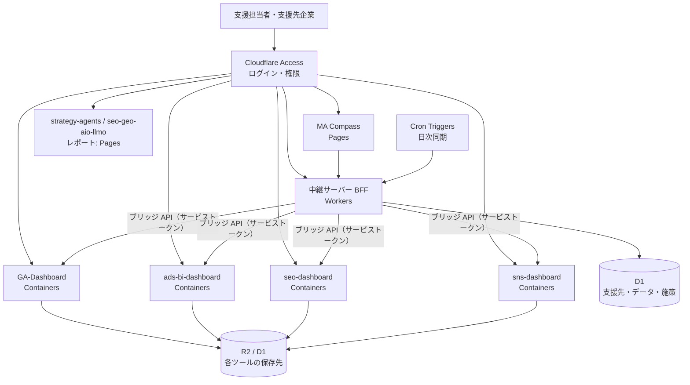

# 公開設計書：Cloudflare でのホスティングと認証

| 項目 | 内容 |
|---|---|
| 文書バージョン | v0.2（無料プラン・Google ログイン・2 ロールで確定） |
| 作成日 | 2026-09-30 |
| 前提 | MA Compass と既存 6 ツールを、ログイン認証つきで公開する。複数の支援先企業で使う |
| 関連文書 | [統合設計書](./05-integration-design.md) |

---

## 1. 結論

**Cloudflare で公開できます。** ただし、既存ツールのうち 2 つの制約（下表の ❌）があるため、構成を「そのまま動かすもの」と「Cloudflare 向けに置き換えるもの」に分けます。

| 要件 | Cloudflare の対応 | 判定 |
|---|---|---|
| MA Compass（静的 SPA）の公開 | Pages | ✅ そのまま |
| ログイン認証（全ツール共通） | Zero Trust Access（Google アカウント・メールのワンタイムコード等） | ✅ コード変更なし |
| 中継サーバー（BFF）・定期同期 | Workers ＋ Cron Triggers ＋ D1 / KV | ✅ 新規実装 |
| API キー・トークンの保管 | Workers Secrets（暗号化） | ✅ |
| Express 製の既存ツールをそのまま動かす | Containers | ✅ ただしディスクは揮発性（下記） |
| SQLite（better-sqlite3）での永続化 | ❌ Containers のディスクはスリープ後に消える | → D1 または R2 へ移行 |
| Google 公式クライアント（Google Ads / GA4 の gRPC ライブラリ）を Workers で実行 | ❌ Workers は外向きの gRPC 非対応 | → Containers で動かす、または REST API に置き換え |
| strategy-agents（Claude Code での長時間・対話型実行） | Workers からは実行しない | → ローカル実行を継続し、結果の JSON だけを連携（Phase 3 で Agent SDK のジョブ化を検討） |

参考：[Cloudflare Containers 概要](https://developers.cloudflare.com/containers/)、[Containers の制限](https://developers.cloudflare.com/containers/platform-details/limits/)、[Workers の Node.js 互換](https://blog.cloudflare.com/nodejs-workers-2025/)、[Workers と gRPC](https://github.com/cloudflare/workerd/discussions/4534)

---

## 2. 構成



| 構成要素 | 置き場所 | 役割 |
|---|---|---|
| MA Compass | Pages | 画面。データは BFF から取得（現在の localStorage 保存を置き換え） |
| BFF | Workers | 支援先ごとの権限確認、各ツールのブリッジ API の取得、D1 への保存、トークン保管 |
| 既存 4 ツール（Express） | Containers | コード変更を最小にして公開。各ツールの画面は MA Compass からのリンク先 |
| レポート系（strategy-agents / seo-geo-aio-llmo） | Pages（すでに想定済み） | 生成はローカル。成果物（HTML / JSON）を公開 |

---

## 3. 複数の支援先企業で使うための設計

| 項目 | 方針 |
|---|---|
| テナント分離 | D1 のすべての行に `workspace_id`。BFF で、ログインユーザーが権限を持つ支援先の行だけを返す |
| ロール | 運用者（全支援先）・担当者（担当する支援先のみ）・支援先の閲覧者（自社のみ・読み取り専用） |
| 認証 | Cloudflare Access で本人確認 → BFF が Access の JWT（`Cf-Access-Jwt-Assertion`）を検証し、メールアドレスからロールと担当支援先を引く |
| 各ツールとの接続 | 支援先ごとに「ツールの URL と ID」を持つ（実装済み：設定 → 各ツールの接続先）。ツール間の API 呼び出しは Access のサービストークンで行い、利用者のブラウザにはトークンを渡さない |
| 各ツール側の支援先 | GA-Dashboard はプロパティ、ads-bi-dashboard はクライアント ID で既に複数社に対応済み。MA Compass の支援先と 1 対 1 で対応付ける |

---

## 4. 各ツールの公開に必要な作業

| ツール | 必要な作業 | 規模 |
|---|---|---|
| MA Compass | BFF 経由のデータ取得に切り替え（`buildDataset` の入力を API に）、支援先・施策を D1 に保存 | 中 |
| GA-Dashboard | Containers 化（Dockerfile）。`data/cache` を R2 に保存。サービスアカウント鍵を Secret に。`BRIDGE_TOKEN` と `BRIDGE_ALLOWED_ORIGINS` を設定（実装済み） | 小〜中 |
| ads-bi-dashboard | Containers 化。CORS を許可リスト化（現在は全開放）。Google Ads の認証情報を Secret に。モック自動切替を本番では無効化 | 小〜中 |
| seo-dashboard | **公開前に必須**：API キー類を SQLite から Secret へ移し、仮実装の認証を Access に置き換え。SQLite を D1 へ | 中 |
| sns-dashboard | Containers 化。SQLite を D1 へ。暗号化キーを Secret に | 中 |
| strategy-agents / seo-geo-aio-llmo | 既存の Pages 構想のまま。MA Compass 用の JSON 出力を追加（Phase 3） | 小 |

**SQLite の扱い**：Containers はスリープ後にディスクが初期化されるため、SQLite ファイルをそのまま使うとデータが消えます。移行先は D1（SQLite 互換の SQL なので移行しやすい）を第一候補にします。

---

## 5. Cloudflare で実現が難しい場合の代替

| 課題 | 代替案 |
|---|---|
| Containers の制約（揮発性ディスク、インスタンス上限など）が運用に合わない | 既存ツールだけを Google Cloud Run（または Fly.io）で動かし、前段を Cloudflare Tunnel ＋ Access にする。認証と入口は Cloudflare のまま統一できる |
| gRPC ライブラリを Workers で使いたい | BFF から直接呼ばず、Containers 上の各ツールのブリッジ API を経由する（本設計の標準） |
| strategy-agents をサーバーで自動実行したい | Claude Agent SDK をコンテナ（Cloud Run Jobs または Containers）で実行し、人の承認ゲートを D1 の状態として管理 |

---

## 6. 進め方

1. **Access で入口を作る**：MA Compass を Pages に公開し、Access で保護（ここまではコード変更なし）
2. **BFF と D1**：支援先・接続先・施策を D1 へ。MA Compass をログインユーザー単位の表示に
3. **既存ツールの公開**：ads-bi-dashboard と GA-Dashboard を Containers 化（ブリッジ API 実装済みのため先行）
4. **seo-dashboard・sns-dashboard**：秘密情報の移行と D1 化のあとで公開
5. **自動同期**：Cron Triggers で日次にブリッジ API を取得


---

## 7. 決定事項（2026-09-30）

| 項目 | 決定 |
|---|---|
| ログイン | Google アカウント（Cloudflare Access の Google 連携） |
| 権限 | **管理者**：支援先の登録を含む全機能・全支援先 ／ **閲覧者**：割り当てた支援先（自社）のデータのみ、読み取り専用 |
| プラン | Cloudflare 無料プラン |
| ドメイン | 当面は `*.pages.dev`。ブランド名決定後に独自ドメインを検討 |

### 7.1 無料プランでできること・できないこと

| 対象 | 無料プランでの可否 | 補足 |
|---|---|---|
| MA Compass の画面（Pages） | ✅ | 静的配信は無制限 |
| API（Pages Functions） | ✅ | Workers 無料枠：1 日 10 万リクエスト |
| データベース（D1） | ✅ | 無料枠内で十分（支援先・施策・取り込みデータ） |
| Google ログイン（Access） | ✅ | **50 ユーザーまで無料**。登録時に支払い方法の入力を求められるが、無料プランでは課金されない |
| 既存ツールの常時稼働（Containers） | ❌ | Workers 有料プラン（月 5 ドル）が必要 |
| 既存ツールの公開（Cloudflare Tunnel） | ✅ | **手元の PC で起動中のツールを Access 付きで公開**できる（PC がオフだと見られない） |

→ **MA Compass 本体は無料で常時公開**し、既存ツールは当面 **Cloudflare Tunnel（無料）** で公開します。常時稼働が必要になった時点で、Containers（月 5 ドル）または Google Cloud Run（無料枠あり）へ移します。

参考：[Zero Trust 無料プラン](https://community.cloudflare.com/t/zero-trust-free-plan/402097)、[Workers の料金](https://developers.cloudflare.com/workers/platform/pricing/)、[Containers の料金](https://developers.cloudflare.com/containers/platform/pricing/)

### 7.2 実装済みの仕組み（本リポジトリ）

| 部品 | ファイル | 内容 |
|---|---|---|
| API | `server/api.ts`、`functions/api/[[route]].ts` | `/api/me`・`/api/state`・支援先の保存/削除・取り込みデータ・ユーザー管理。すべて権限チェック付き |
| 認証 | `server/auth.ts` | Access の JWT を公開鍵で検証（ヘッダーのメールアドレスは信用しない）。`ADMIN_EMAILS` は常に管理者 |
| DB | `migrations/0001_init.sql` | users / user_workspaces / workspaces / imports / audit_log（変更履歴） |
| 画面 | `src/remote/*` | ログイン中のユーザーのデータだけを読み込み、管理者の変更を自動保存。閲覧者は編集操作・管理画面を非表示 |
| テスト | `tests/api.test.ts` | 未ログイン・未登録・閲覧者の書き込み拒否・他社データの非表示などを実 SQL で検証 |

閲覧者の制限は画面だけでなく API 側でも強制しています（画面を改変しても書き込み・他社データの取得はできません）。

---

## 8. 公開手順（無料プラン）

所要時間の目安：30〜60 分。Cloudflare と Google Cloud のアカウントが必要です。

### 8.1 Google ログインの準備（Google Cloud）
1. Google Cloud コンソール → 「API とサービス」→「OAuth 同意画面」を作成（外部・アプリ名 MA Compass）
2. 「認証情報」→「OAuth クライアント ID」（ウェブアプリケーション）を作成
3. 承認済みリダイレクト URI に `https://<チーム名>.cloudflareaccess.com/cdn-cgi/access/callback` を登録
4. クライアント ID とシークレットを控える

### 8.2 Cloudflare Zero Trust（Access）
1. Cloudflare ダッシュボード → Zero Trust → チーム名を決める（例：`ma-compass`）→ **Free プラン**を選択
2. 設定 → 認証 → ログイン方法に **Google** を追加（8.1 の ID とシークレット）

### 8.3 D1 と Pages
```bash
npx wrangler login
npx wrangler d1 create ma-compass          # 表示された database_id を wrangler.toml に記入
npm run cf:deploy                          # ビルド → D1 マイグレーション → Pages の本番（main）へ公開
```

### 8.4 Access でアプリを保護
1. Zero Trust → Access → アプリケーション → 「セルフホスト」を追加
2. ドメイン：`ma-compass.pages.dev`（プレビュー URL も保護する場合は `*.ma-compass.pages.dev` も追加）
3. ポリシー：「許可」— 利用者のメールアドレス（または自社ドメイン）を指定。**支援先の担当者を追加するときは、ここにもメールアドレスを追加**
4. 作成後に表示される **Application Audience (AUD) タグ** を控える

### 8.5 シークレット（認証の設定値）
`wrangler.toml` があると Pages の設定はファイルが正となりダッシュボードの環境変数は使われないため、認証の設定値は**シークレット**として登録します（公開リポジトリにも残りません）。

```bash
npx wrangler pages secret put ACCESS_TEAM_DOMAIN --project-name ma-compass   # https://<チーム名>.cloudflareaccess.com
npx wrangler pages secret put ACCESS_AUD --project-name ma-compass           # 8.4 の AUD タグ
npx wrangler pages secret put ADMIN_EMAILS --project-name ma-compass         # 最初の管理者の Google アカウント
```

**8.3〜8.5 は `node scripts/cf-setup.mjs` で一括実行できます**（API トークンと Google のクライアント ID/シークレットを環境変数で渡す。スクリプト冒頭に必要な権限を記載）。
設定後にもう一度 `npm run cf:deploy`。初回ログイン時にサンプルの支援先 3 社が作られます（不要なら設定から削除）。

### 8.5.1 公開済みの環境（2026-10-02）
| 項目 | 値 |
|---|---|
| URL | https://ma-compass.pages.dev（Google ログイン必須） |
| D1 | `ma-compass`（ID は wrangler.toml に記入済み） |
| Google ログイン | Google Cloud プロジェクト `GA-icloud` の OAuth クライアント（同意画面は外部・本番環境） |
| シークレット | `ACCESS_TEAM_DOMAIN`・`ACCESS_AUD`・`ADMIN_EMAILS`・`ANTHROPIC_API_KEY`（2026-10-03 にダッシュボードから登録） |

Pages の本番ブランチは `main`。`npm run cf:deploy` は `--branch main` 付きで本番に公開する（付けないとプレビュー URL への公開になる）。

### 8.5.2 AI による解説（Claude API）
「AI インサイト」画面の解説と質問応答は、サーバー側で Claude API（モデル `claude-opus-5-5`）を呼びます。API キーは Pages のシークレットに置き、画面には出しません。

```bash
npx wrangler pages secret put ANTHROPIC_API_KEY --project-name ma-compass   # 値は対話入力（チャット等に貼らない）
npm run cf:deploy
```

- 解説の作成は管理者のみ。作成した解説は支援先ごとに D1（`ai_reports`）に保存され、閲覧者も読める
- 質問は 1 人 1 日 30 回まで（`audit_log` で数える）
- Claude に送るのは画面と同じ集計値（KPI・チャネル別・インサイト・トリップワイヤー）だけで、明細行は送らない
- 安全上の理由で回答が断られた場合は、API 側で自動的に別のモデルで再実行する（`fallbacks: "default"`）

### 8.6 支援先の担当者（閲覧者）を追加する
1. MA Compass → 設定 → ユーザーと権限 → メールアドレス・「閲覧者」・支援先を選んで追加
2. Access のポリシー（8.4-3）にも同じメールアドレスを追加

### 8.7 既存ツールの公開（Cloudflare Tunnel・無料）
```bash
# ツールを起動している PC で
cloudflared tunnel login
cloudflared tunnel create tools
cloudflared tunnel route dns tools ga.<独自ドメイン>        # 独自ドメインがない間は Quick Tunnel か、ドメイン取得後に設定
cloudflared tunnel run --url http://localhost:3000 tools
```
Tunnel の公開ホスト名にも Access アプリケーションを設定し、同じ Google ログインで保護します。**Tunnel の永続的なホスト名には Cloudflare 上のドメインが必要**なため、独自ドメイン決定までは MA Compass から「ローカルの URL」を開く運用とし、ドメイン取得後に切り替えます。

### 8.8 ローカルで本番と同じ構成を試す
```bash
cp .dev.vars.example .dev.vars   # DEV_AUTH_EMAIL で指定したユーザーとしてログイン扱い（localhost のみ有効）
npm run cf:dev                   # http://localhost:8788
```

### 8.9 公開版 MA Compass から各ツールのデータを取得する
連携ハブの「すべて更新」「API から取得」は、**画面を開いているブラウザ**から各ツールのブリッジ API（`http://localhost:…`）へ直接取りに行きます。独自ドメインと Tunnel が決まるまでは、次の運用にします。

1. ツールを起動している PC で、公開版 MA Compass（`https://ma-compass.pages.dev`）を開く
2. 各ツールの CORS 許可リストに公開版の URL を追加する（`.env`）

   | ツール | 設定 |
   |---|---|
   | ads-bi-dashboard | `CORS_ALLOWED_ORIGINS=http://localhost:5173,https://ma-compass.pages.dev` |
   | GA-Dashboard | `BRIDGE_ALLOWED_ORIGINS=http://localhost:5173,https://ma-compass.pages.dev` |
   | seo-dashboard | `BRIDGE_ALLOWED_ORIGINS=http://localhost:5173,https://ma-compass.pages.dev` |
   | sns-dashboard | `CORS_ALLOWED_ORIGINS=http://localhost:5173,https://ma-compass.pages.dev` |

3. 各ツールに `BRIDGE_TOKEN` を設定し、同じ値を連携ハブのトークン欄に入力する（トークンは保存されず、再読み込みで消えます）
4. 初回の取得時に Chrome が「ローカル ネットワーク上のデバイスへのアクセス」の許可を求めたら「許可」する

取り込んだデータは D1 に保存されるため、閲覧者（支援先の担当者）はツールがない環境でも最新の取り込み結果を見られます。取得（更新）できるのは管理者のみです。
